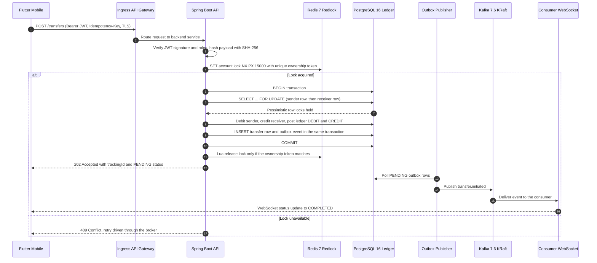
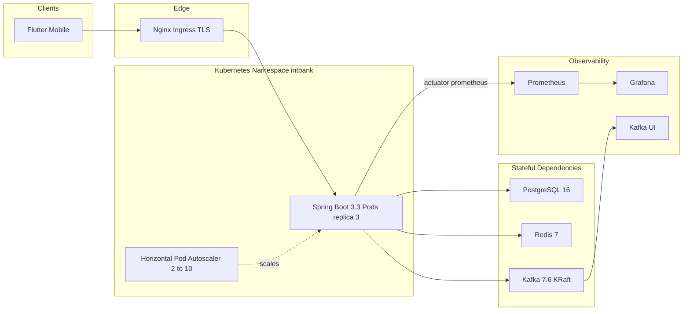

<p align="center">
  
</p>

<p align="center">
  <h3 align="center">Secure Internet Banking Platform</h3>
</p>

<p align="center">
  A modern, event-driven Internet Banking application built with <strong>Flutter</strong> and <strong>Spring Boot</strong>, featuring real-time transactions via <strong>Apache Kafka</strong>, SMS-based two-factor authentication, a double-entry ledger, and a hexagonal architecture backend.
</p>

<p align="center">
  
  
  
  
  
  
</p>

---

## Table of Contents

- [Key Features](#key-features)
- [System Architecture & Data Flow](#system-architecture--data-flow)
- [Architecture & Tech Stack](#architecture--tech-stack)
- [STRIDE Security Threat Model](#stride-security-threat-model)
- [Mathematical Proof of Anti-Double-Spend Concurrency](#mathematical-proof-of-anti-double-spend-concurrency)
- [Cloud-Native Infrastructure Guide](#cloud-native-infrastructure-guide)
- [Automated Concurrency Benchmark Reproduction](#automated-concurrency-benchmark-reproduction)
- [Project Structure](#project-structure)
- [Prerequisites](#prerequisites)
- [Getting Started](#getting-started)
- [API Endpoints](#api-endpoints)
- [Security Measures](#security-measures)
- [Testing](#testing)
- [Contributing](#contributing)
- [License](#license)

---

## Key Features

### Secure Authentication
- **Phone-based login** with SMS OTP via Twilio Verify
- **Two-Factor Authentication (2FA)** with configurable retry limits and cooldown periods
- **JWT-based client tokens** with short-lived access tokens (5 min) and refresh token rotation
- **RSA-2048 / RS256 verification keys** published through a JWKS endpoint, with an HMAC-SHA256 fallback and an HMAC request-binding guard
- **Token blacklisting** in Redis on logout or expiry
- **Rate limiting** on sensitive endpoints (OTP resend: 1-minute cooldown)

### User Registration & Onboarding
- Multi-step registration flow with Romanian national fields (CNP, county, locality)
- Address geocoding integration for accurate location data
- Terms & conditions acceptance tracking
- Admin approval workflow for new accounts

### Transfers & Payments
- **IBAN-to-IBAN transfers** with beneficiary and sender metadata
- **Distributed locking (Redis Redlock)** plus **database pessimistic locking** for race-free balance mutation
- **Asynchronous processing** via Apache Kafka with the **Saga orchestration pattern** for distributed consistency
- **Transactional outbox** with dead-letter queue (DLQ) for reliable message delivery
- **Idempotency keys** with SHA-256 request hashing to make retries and replays no-ops
- **Double-entry ledger** postings (immutable DEBIT and CREDIT rows) with reconciliation
- Real-time transfer status updates via WebSocket push notifications
- **Kafka UI** dashboard for monitoring message queues

### Account Management
- Multi-currency account balances with Redis-backed cache
- Exchange rate lookups with configurable refresh intervals
- Transaction history with filtering and pagination

### Admin Dashboard
- Outbox statistics and dead-message reprocessing
- DLQ monitoring and manual intervention endpoints
- Read-model projector health checks
- Balance cache operational status

### User Experience
- Modern **Material 3** design with Google Fonts (Inter)
- Custom PIN pad for secure numeric input
- Step indicators for multi-step flows
- Romanian-language interface with localized error messages

---

## System Architecture & Data Flow

The end-to-end payment path is a single request that crosses the mobile client, the ingress layer, the Spring Boot service, Redis, PostgreSQL, and Kafka. The sequence diagram below shows the happy path and the fail-closed branch when the distributed lock cannot be acquired.



The same topology as deployed infrastructure (Docker Compose locally, Kubernetes in production) is shown below. Kafka runs in **KRaft** mode with no ZooKeeper, and Prometheus scrapes the Spring Boot actuator metrics endpoint.



---

## Architecture & Tech Stack

| Layer | Technology | Purpose |
|---|---|---|
| **Frontend** | Flutter 3.x, Dart SDK ^3.9.2 | Cross-platform mobile & web UI |
| **State Management** | Riverpod (`flutter_riverpod`) | Reactive, compile-safe state management |
| **Routing** | GoRouter v14 | Declarative, type-safe navigation |
| **HTTP Client** | Dio v5 + `http` | REST API communication |
| **Real-Time** | `web_socket_channel` | Live transfer status updates |
| **Secure Storage** | `flutter_secure_storage` | On-device credential persistence |
| **Transport Security** | SHA-256 certificate pinning (`SslPinningService`) | MITM defense with primary and backup pins |
| **Backend** | Spring Boot 3.3.3, Java 21 | REST API & business logic |
| **Architecture** | Hexagonal (Ports & Adapters) | Clean separation of domain, application, and infrastructure |
| **Database** | PostgreSQL 16 | ACID persistence, double-entry ledger, pessimistic row locks |
| **Cache** | Redis 7 | Redlock, idempotency locks, token blacklisting, rate limits |
| **Messaging** | Confluent Kafka 7.6.0 (cp-kafka, KRaft) | Async transfer processing, Saga orchestration, transactional outbox |
| **Coordination** | Redis Redlock + database row locks | Cross-pod mutual exclusion and in-transaction serialization |
| **Auth** | JWT (jjwt 0.12.6), RSA-2048 JWKS, Twilio Verify | RS256 client tokens, SMS OTP 2FA |
| **Cryptography** | AES-256-GCM, HMAC-SHA256 | Card encryption and PSD2 dynamic-linking request binding |
| **Rate Limiting** | Bucket4j v8 + `TokenBucketRateLimiter` | Per-endpoint and per-client throttling |
| **Resilience** | Resilience4j circuit breakers | Currency, SMS, and geocoding isolation |
| **TLS** | Self-signed certs (`certs/`) | HTTPS with TLS 1.2+ |
| **Logging** | Logstash Logback Encoder, `X-Correlation-ID` MDC | Structured JSON logging with request correlation |
| **Containerization** | Docker Compose (7 services) | Reproducible local & CI environments |
| **Orchestration** | Kubernetes + Helm (`k8s/helm/intbank`) | HPA, PDB, topology spread, NetworkPolicy |
| **Monitoring** | Prometheus, Grafana, Kafka UI | Metrics, dashboards, broker visualization |

### Hexagonal Architecture (Backend)

```
com.intbank
|-- application/          -> Use cases, Saga orchestrator
|-- core/
|   |-- domain/           -> Domain entities, value objects
|   `-- port/             -> Input/output port interfaces
|-- infrastructure/
|   |-- rest/             -> Controllers & DTOs (primary adapters)
|   |-- persistence/      -> JPA entities & repositories (secondary)
|   |-- messaging/        -> Kafka producers/consumers (secondary)
|   |-- security/         -> JWT filters, CORS config
|   |-- websocket/        -> WebSocket handlers
|   `-- exception/        -> Global error handling
|-- service/              -> Domain services (crypto, currency, outbox, retry)
`-- config/               -> Spring bean configurations
```

---

## STRIDE Security Threat Model

This is the official STRIDE threat matrix for the platform. Every mitigation maps to code that exists in this repository.

| Threat Category | Attack Scenario | Technical Mitigation |
|---|---|---|
| **Spoofing** | An attacker impersonates a user or a legitimate service by forging or replaying a token, or by presenting a stolen credential over a MITM proxy. | RSA-2048 RS256 signing keys are exposed to verifiers through the JWKS endpoint `/.well-known/jwks.json` (key id `intbank-rsa-key-1`). `ClientTokenFilter` verifies the RSA signature against the public key and falls back to the HMAC-SHA256 secret. `DynamicLinkingService` binds challenge id, amount, and IBAN with an HMAC-SHA256 signature. Refresh tokens are 32-byte random values rotated in Redis, and `SslPinningService` rejects any certificate whose SHA-256 fingerprint does not match a registered pin. |
| **Tampering** | An attacker mutates the `amount` or destination `IBAN` in transit, or replays a captured body with altered fields. | Every write is bound to a client `Idempotency-Key` and a SHA-256 canonical request hash (`IdempotencyService.hashRequest` over `fromIban / toIban / amount / currency / reason`). Reusing a key with a different payload is rejected. PSD2 dynamic linking signs `challengeId / amount / toIban` with HMAC-SHA256 and marks mismatches `TAMPERED`. The `audit_logs` table is an append-only SHA-256 hash chain. |
| **Repudiation** | A user denies having initiated a transfer, or an operator denies an administrative action. | Every request is tagged with an `X-Correlation-ID` by `CorrelationIdFilter` and written to the SLF4J MDC. The `audit_logs` table stores `previous_hash` and `current_hash` for each row; `AuditLogService.verifyAuditIntegrity()` recomputes the entire chain to prove nothing was altered or removed. Ledger entries are immutable DEBIT / CREDIT postings. |
| **Information Disclosure** | Card data, credentials, or on-screen transaction data leaks through a compromised network, a rooted device, or a screenshot. | `SslPinningService` enforces SHA-256 certificate and public-key pinning with expiring primary and backup pins. `CryptoService` encrypts card data with AES-256-GCM using a fresh random 12-byte IV and a 128-bit authentication tag. The Flutter `ScreenProtectionService` applies the Android `FLAG_SECURE` equivalent for screenshot blocking, and tokens are kept in platform secure storage. |
| **Denial of Service** | Brute-force login, SMS pumping, or high-volume request floods exhaust the service or the SMS budget. | `TokenBucketRateLimiter` (with an exact-conservation concurrency test) and Bucket4j add per-client and per-endpoint throttling. OTP resend is held to a 60-second cooldown keyed in Redis (`otp:sms:last:*`). Spring Security sets HSTS, frame denial, and a strict CSP. Resilience4j circuit breakers isolate downstream currency, SMS, and geocoding failures, while Kafka consumer lag is absorbed by the outbox poller. |
| **Elevation of Privilege** | A user performs horizontal or vertical privilege escalation, for example by reading another user's transfer or calling an admin endpoint (BOLA / IDOR). | `SecurityConfig` is stateless with no client-supplied roles: `/admin/**` requires `ROLE_ADMIN`, while `/transfers/**` and `/users/**` require authentication. `ClientTokenFilter` validates JWT claims and derives authorities from the signed `roles` claim only. `InitiateTransferUseCase.verifyOwnership` compares the authenticated `uid` against the source account owner and throws on mismatch, enforcing zero-trust account-level authorization. |

---

## Mathematical Proof of Anti-Double-Spend Concurrency

The ledger guarantees that a single account balance can never be overspent, even under a worst-case interleaving of concurrent transfers across horizontally scaled pods. The guarantee is layered: Redis Redlock provides cross-pod mutual exclusion, PostgreSQL `SELECT ... FOR UPDATE` provides the linearization point, and idempotency keys plus unique constraints make replay a no-op.

### Layer 1 - Redis Redlock (mutual exclusion across pods)

`RedlockDistributedLockService.acquireLock` issues a single atomic Redis command:

```
SET account:lock:<accountId> <token> NX PX <leaseMillis>
```

where `<token> = UUID + ":" + Thread.currentThread().threadId()` (`RedlockDistributedLockService.java:65-75`). Because `SET ... NX` is atomic server-side, exactly one caller can hold the key for a given account while it exists. The token is a **unique ownership (fencing) token**: `releaseLock` runs a Lua script that deletes the key only if the stored value equals the caller's token (`UNLOCK_LUA`, `RedlockDistributedLockService.java:29-36`). A holder whose lease expired can therefore never release a lock now owned by a newer holder, which preserves mutual exclusion under clock skew and stop-the-world pauses. In a multi-master deployment the same primitive is quorum-based (acquire only if `floor(N/2)+1` masters acknowledge within the lease window and total acquisition time is below the lease); this repository ships the single-instance local configuration of that same service contract.

### Layer 2 - Database pessimistic lock (the linearization point)

Inside the `@Transactional` boundary, the sender and receiver rows are read with `findByIdWithLock`, which is a `@Lock(LockModeType.PESSIMISTIC_WRITE)` query (`AccountJpaRepository.java:21-23`) that Hibernate renders as `SELECT ... FOR UPDATE` (`ProcessTransferUseCase.java:112-143`). The database takes an exclusive row lock on each selected row and holds it until the transaction commits or rolls back. A concurrent transaction requesting the same row blocks.

The **linearization point** of a transfer is the successful `SELECT ... FOR UPDATE` on the sender row. At that instant the reading transaction holds the exclusive lock and everything after it executes as an atomic read-check-write: read the committed balance, compare it against the amount, compute the new balance, and write it. No other transaction can observe or mutate the sender balance in between. At the default `READ_COMMITTED` isolation level, `FOR UPDATE` performs a current read (not a snapshot read), so the second transaction always observes the first transaction's committed balance rather than a stale snapshot, preventing both lost updates and dirty reads.

### Layer 3 - Idempotency and unique constraints (replay is a no-op)

`IdempotencyService.beginOrGet` first claims `idem:lock:<key>` with `SET NX` and a 120-second TTL, then inserts an `idempotency_records` row keyed by the unique `Idempotency-Key`. The database unique constraint is the final arbiter: a concurrent duplicate either loses the Redis claim (and receives `DUPLICATE_IN_PROGRESS`) or violates the unique key. A completed replay returns the cached response payload, and `hashRequest` (SHA-256 over `fromIban / toIban / amount / currency / reason`) was stored alongside the key, so reusing the key with different parameters is rejected. A replay can therefore never execute a second debit.

### The interleaving argument

Claim: for any two concurrent transfers `T1` and `T2` targeting the same sender account `A` with committed balance `B` and amount `x`, at most one can debit `A`, and the balance can never become negative.

1. **At most one lock holder.** Suppose both transactions acquire the Redlock on `account:lock:<A>`. This is impossible: `SET NX` is atomic, so at most one wins while the key exists. The loser either fails closed (`ProcessTransferUseCase.java:95-99` throws, the controller returns a conflict, and the durable outbox retries later) or waits until the lease expires. If `T1`'s lease expires mid-flight and `T2` acquires a fresh lock, `T1`'s release is a no-op because its token no longer matches, so `T1` cannot delete `T2`'s lock. In the worst interleaving there is at most one effective holder during the database phase.
2. **Database serialization.** Even if the lock layer is bypassed entirely, both transactions execute `SELECT ... FOR UPDATE` on row `A`. One acquires the exclusive row lock and the other blocks. When the second proceeds it reads the value committed by the first, computes `B - x`, and rejects with insufficient funds if `B - x < x`. This forces `B >= 0` at all times and eliminates lost updates, independent of the Redis layer.
3. **Atomicity.** The sender debit, receiver credit, transfer status update, and both ledger postings execute in a single transaction. Either all of them commit or none do. The double-entry invariant (total of DEBIT rows equals total of CREDIT rows) therefore holds transaction by transaction, and `LedgerReconciliationService` asserts it across the whole ledger.
4. **Replay is a no-op.** An identical retry with the same `Idempotency-Key` collides with the in-flight lock or the unique constraint and returns the cached response; it never reaches the debit logic a second time.

### Deadlock avoidance and lock ordering

Within a single transfer, the two row locks are always acquired in a fixed order: sender first, then receiver (`ProcessTransferUseCase.java:114-120`). Combined with the sender-scoped Redlock, two transfers out of the same sender are fully serialized, so they cannot form a lock cycle. The only residual cycle is between opposite-direction transfers (`A -> B` and `B -> A`) that lock the two rows in different orders. PostgreSQL's deadlock detector detects that cycle and aborts one transaction; the durable outbox re-drives it, so the system always makes progress and never deadlocks indefinitely. A strict global ordering by numeric account id would remove even this residual by construction.

---

## Cloud-Native Infrastructure Guide

### Local full stack with Docker Compose

The Compose stack starts seven services on two isolated bridge networks (`intbank-network` and `observability-network`): Postgres 16, Redis 7, the Spring Boot backend, Kafka 7.6 in **KRaft mode**, Kafka UI, Prometheus, and Grafana. There is no ZooKeeper service.

```bash
cd server

# Set the database password consumed by docker-compose.yml (required).
export DB_PASSWORD='your_secure_password'

# Start the entire stack.
docker compose up -d

# Confirm every container is healthy.
docker compose ps
```

On Windows PowerShell, set the variable with `$env:DB_PASSWORD = "your_secure_password"` before running `docker compose up -d`.

Service endpoints after startup:

| Service | URL | Notes |
|---|---|---|
| Backend API | https://localhost:8443 | TLS enabled, `/health` and `/actuator/health/*` |
| Kafka UI | http://localhost:8080 | Broker, topic, and consumer group visualization |
| Prometheus | http://localhost:9090 | Scrapes `/actuator/prometheus` |
| Grafana | http://localhost:3000 | Default admin credentials from `GRAFANA_PASSWORD` |
| PostgreSQL | localhost:5432 | Database `intbank`, user `intbank_user` |
| Redis | localhost:6379 | Append-only persistence enabled |
| Kafka | localhost:9092 / localhost:29092 | Internal and host listeners |

### Production deploy with Kubernetes and Helm

The Helm chart lives at `k8s/helm/intbank` and enables rolling updates (`maxUnavailable: 0`), a Horizontal Pod Autoscaler (2 to 10 replicas), a PodDisruptionBudget, anti-affinity plus topology spread across zones, an Nginx Ingress with cert-manager TLS, a NetworkPolicy, and External Secrets Operator support for production secrets.

```bash
# Validate the chart before deploying.
helm lint k8s/helm/intbank

# Install or upgrade the production release.
helm upgrade --install intbank k8s/helm/intbank \
  -n intbank --create-namespace \
  -f k8s/helm/intbank/values-prod.yaml
```

Observability is wired through the Spring Boot actuator endpoint: `management.endpoints.web.exposure.include` contains `health, info, metrics, prometheus`, and tracing is exported with the W3C propagation format. Prometheus scrapes the backend, and Grafana is provisioned against Prometheus.

---

## Automated Concurrency Benchmark Reproduction

The current test suite contains one genuinely multi-threaded, latch-synchronized benchmark and a set of deterministic tests that verify the anti-double-spend transaction path.

### Multi-threaded benchmark (real threads, exact conservation)

`com.intbank.infrastructure.security.TokenBucketRateLimiterTest#concurrentConsumption_conservesTokensExactly` launches 8 worker threads through a `CountDownLatch` start gate and fires 25 requests each (200 total) against a single shared 100-token bucket. The test asserts exact conservation: exactly 100 requests are allowed, exactly 100 are rejected, the client bucket ends at zero tokens, and no worker throws.

```bash
cd server/backend
./mvnw test -Dtest=TokenBucketRateLimiterTest#concurrentConsumption_conservesTokensExactly
```

On Windows use `.\mvnw.cmd test "-Dtest=TokenBucketRateLimiterTest#concurrentConsumption_conservesTokensExactly"`.

Expected output: `BUILD SUCCESS` with `Tests run: 1, Failures: 0, Errors: 0`. The assertions prove that concurrent admission control never over-consumes (allowed count equals capacity exactly) and never under-counts (rejected count equals total minus capacity).

### Anti-double-spend transaction verification

The ledger concurrency and replay guarantees are asserted by these deterministic tests:

- `com.intbank.RedlockDistributedLockServiceTest` verifies lock acquisition with a lease, `SET NX` failure on timeout, token-guarded Lua release, fallback delete, full transfer integration under the lock, and fail-closed behavior when the lock cannot be acquired (`testProcessTransferUseCase_FailsWhenLockCannotBeAcquired`).
- `com.intbank.BankingEndToEndIntegrationTest#testCompleteBankingTransferLifecycle_CorrelatedFlow` verifies idempotency state, transactional outbox persistence, the cryptographic audit trail, and double-entry reconciliation where total debits equal total credits.
- `com.intbank.IdempotencyServiceTest` verifies completed-duplicate and in-flight-duplicate handling, including rejection of a reused key with a different payload hash.

```bash
cd server/backend
./mvnw test -Dtest=RedlockDistributedLockServiceTest,BankingEndToEndIntegrationTest,IdempotencyServiceTest
```

Expected output: `BUILD SUCCESS`, no negative balances (the insufficient-funds branch is exercised), and exactly one debit per accepted transfer.

---

## Project Structure

```
INTBank/
|-- internet_banking/           # Flutter frontend
|   |-- lib/
|   |   |-- config/             # App configuration
|   |   |-- core/               # Network, TLS pinning, storage, utilities
|   |   |-- data/models/        # JSON-serializable models
|   |   |-- features/           # Feature modules (auth, home, transfers, etc.)
|   |   |-- providers/          # Riverpod state providers
|   |   |-- router/             # GoRouter configuration
|   |   |-- services/           # API, JWT, currency services
|   |   `-- widgets/            # Reusable UI components
|   |-- assets/                 # Images, fonts, JSON data
|   |-- test/                   # Unit & widget tests
|   `-- pubspec.yaml
|-- server/
|   |-- docker-compose.yml      # Full stack orchestration (7 services)
|   |-- .env                    # Environment variables
|   |-- certs/                  # TLS certificates
|   |-- prometheus/             # Prometheus scrape configuration
|   `-- backend/                # Spring Boot backend
|       |-- Dockerfile
|       |-- pom.xml
|       `-- src/
|           |-- main/java/com/intbank/
|           |-- main/resources/db/migration/   # Flyway V1-V6
|           `-- test/java/com/intbank/
|-- k8s/helm/intbank/           # Kubernetes Helm chart
|-- plans/                      # Architecture and hardening design notes
|-- LICENSE.md
`-- README.md
```

---

## Prerequisites

| Tool | Minimum Version | Purpose |
|---|---|---|
| **Git** | 2.x | Clone the repository |
| **Flutter SDK** | 3.x (Dart ^3.9.2) | Build and run the frontend |
| **Java JDK** | 21 | Compile and run the Spring Boot backend |
| **Maven** | 3.9+ | Backend dependency management & build |
| **Docker** | 24+ | Run PostgreSQL 16, Redis 7, Kafka 7.6 (KRaft), Prometheus, and Grafana |
| **Docker Compose** | 2.x | Orchestrate the multi-container infrastructure |
| **Helm** | 3.x | Deploy the Kubernetes chart |
| **kubectl** | 1.27+ | Access the cluster |

> **Optional:** [Android Studio](https://developer.android.com/studio) or [Xcode](https://developer.apple.com/xcode/) for mobile emulation.

---

## Getting Started

### 1. Clone the Repository

```bash
git clone https://github.com/madallin/INTBank.git
cd INTBank
```

### 2. Configure Environment Variables

Create the required `.env` files for both the server and the Flutter app.

#### Server: `server/.env`

```env
# Database
DB_PASSWORD=your_secure_password

# Twilio (SMS OTP)
TWILIO_ACCOUNT_SID=your_account_sid
TWILIO_AUTH_TOKEN=your_auth_token
TWILIO_SERVICE_SID=your_verify_service_sid

# JWT
JWT_SECRET=your_256_bit_base64_encoded_secret

# Kafka
KAFKA_BROKERS=localhost:9092

# Card encryption (AES-256-GCM)
CARD_ENCRYPTION_KEY=your_card_encryption_key
```

#### Flutter: `internet_banking/.env`

```env
API_BASE_URL=https://YOUR_LOCAL_IP:8443
WS_BASE_URL=wss://YOUR_LOCAL_IP:8443/ws
```

> **Important:** The Flutter app communicates over HTTPS/TLS. The `API_BASE_URL` should use your machine's **local network IP address** (not `localhost` or `127.0.0.1`) when testing on physical devices or emulators. Example: `https://192.168.1.100:8443`.

### 3. Start Infrastructure Services (PostgreSQL, Redis, Kafka)

```bash
cd server
docker compose up -d postgres redis kafka kafka-ui
```

Wait for all services to become healthy:

```bash
docker compose ps
```

Kafka UI will be available at [http://localhost:8080](http://localhost:8080). Kafka runs in KRaft mode, so no ZooKeeper container is started.

### 4. Run the Backend

#### Option A: Maven (Development)

```bash
cd server/backend
./mvnw spring-boot:run -Dspring-boot.run.profiles=dev
```

The backend starts on **port 8443**.

#### Option B: Docker (via Docker Compose)

```bash
cd server
DB_PASSWORD=your_password docker compose up -d backend
```

Verify the backend is running:

```bash
curl -k https://localhost:8443/health
# -> {"status":"ok"}
```

### 5. Run the Frontend

```bash
cd internet_banking
flutter pub get
flutter run
```

Or launch on a specific device:

```bash
# List available devices
flutter devices

# Run on Chrome (web)
flutter run -d chrome

# Run on Android emulator
flutter run -d emulator-5554

# Run on iOS simulator (macOS only)
flutter run -d iPhone-15
```

### 6. Full Stack via Docker Compose (One Command)

```bash
cd server

# Set the DB password environment variable
export DB_PASSWORD=your_secure_password

# Start everything
docker compose up -d
```

This starts PostgreSQL, Redis, Kafka (KRaft), Kafka UI, Prometheus, Grafana, and the Spring Boot backend.

---

## API Endpoints

### Authentication & Verification

| Method | Endpoint | Description | Auth Required |
|---|---|---|---|
| `POST` | `/auth/get-client-token` | Obtain a short-lived JWT client token for a device | No |
| `POST` | `/auth/refresh-client-token` | Refresh an expired client token using a refresh token | Refresh Token |
| `POST` | `/auth/send-otp-sms` | Send an OTP code via SMS to a phone number | Client Token |
| `GET` | `/.well-known/jwks.json` | RSA public keys (JWKS) for RS256 token verification | No |
| `POST` | `/2fa/request` | Request a 2FA verification code (SMS) | Client Token |
| `POST` | `/2fa/verify` | Verify the 2FA code received via SMS | Client Token |

### User Management

| Method | Endpoint | Description | Auth Required |
|---|---|---|---|
| `POST` | `/login` | Check if a user exists by phone number; returns approval status | Client Token |
| `POST` | `/register` | Register a new bank account with personal and address details | Client Token |

### Transfers

| Method | Endpoint | Description | Auth Required |
|---|---|---|---|
| `POST` | `/transfers` | Initiate an IBAN-to-IBAN transfer (async processing via Kafka) | Client Token |

**Sample Transfer Request:**

```json
{
  "fromIban": "RO49AAAA1B31007593840000",
  "toIban": "RO49BBBB1B31007593841111",
  "amount": 250.00,
  "currency": "RON",
  "reason": "Chirie luna iulie",
  "beneficiaryName": "Ion Popescu",
  "senderName": "Maria Ionescu",
  "idempotencyKey": "9f1c2f7e-2b4a-4c6a-9f10-2d3b4c5d6e7f"
}
```

**Sample Response (202 Accepted):**

```json
{
  "status": 202,
  "trackingId": "a1b2c3d4-e5f6-7890-abcd-ef1234567890",
  "message": "Transfer initiated successfully",
  "transferStatus": "PENDING"
}
```

### Admin

| Method | Endpoint | Description | Auth Required |
|---|---|---|---|
| `GET` | `/admin/outbox/stats` | Get outbox table statistics (pending, processed, dead) | Admin |
| `POST` | `/admin/outbox/reprocess-dead` | Requeue all dead-letter messages for reprocessing | Admin |
| `POST` | `/admin/outbox/process-now` | Trigger immediate outbox processing | Admin |
| `GET` | `/admin/dlq/stats` | Get dead-letter queue statistics | Admin |
| `GET` | `/admin/balances` | Check read-model projector and balance cache status | Admin |

### Health

| Method | Endpoint | Description | Auth Required |
|---|---|---|---|
| `GET` | `/health` | Health check endpoint for orchestrator liveness probes | No |
| `GET` | `/actuator/health/liveness` | Kubernetes liveness probe | No |
| `GET` | `/actuator/health/readiness` | Kubernetes readiness probe | No |
| `GET` | `/actuator/prometheus` | Prometheus metrics scrape endpoint | No |

---

## Security Measures

This banking platform implements defense-in-depth security across multiple layers.

### Authentication & Authorization
- **JWT (JSON Web Tokens):** HMAC-SHA256 signed client tokens with 5-minute TTL, plus RSA-2048 RS256 verification keys published via JWKS (`/.well-known/jwks.json`). Refresh tokens are cryptographically random 32-byte values stored in Redis.
- **Two-Factor Authentication (2FA):** SMS-based OTP codes delivered via **Twilio Verify v2**. Enforced cooldown (1 minute) between resend attempts and maximum verification attempts before lockout.
- **Token Blacklisting:** Compromised or logged-out tokens are immediately blacklisted in Redis with TTL equal to the token's remaining lifetime.
- **Role-Based Access Control:** `/admin/**` requires `ROLE_ADMIN`; transfer and user endpoints require authentication. Roles come only from the signed token claim, never from the request body.
- **Account Ownership (BOLA / IDOR):** `InitiateTransferUseCase.verifyOwnership` rejects transfers whose source account is not owned by the authenticated user.

### Transport & Data Protection
- **TLS 1.2+:** All communication between the Flutter client and Spring Boot backend is encrypted using TLS. Certificates are stored in the `server/certs/` directory.
- **Certificate Pinning:** `SslPinningService` validates the SHA-256 fingerprint of the presented certificate or public key against expiring primary and backup pins, and raises security alerts on mismatches or bypass attempts.
- **Card Encryption:** `CryptoService` encrypts card data with AES-256-GCM using a fresh random IV and a 128-bit authentication tag.
- **Screen Protection:** The Flutter `ScreenProtectionService` blocks screenshots and screen recording (the Android `FLAG_SECURE` equivalent).
- **Flutter Secure Storage:** On-device tokens and sensitive data are stored using platform-native secure storage (Keychain on iOS, EncryptedSharedPreferences on Android).

### Integrity & Audit
- **Idempotency:** Client `Idempotency-Key` plus SHA-256 request hash prevents duplicate execution and rejects key reuse with a different payload.
- **Tamper-Evident Audit Trail:** The append-only `audit_logs` table chains each entry to the previous one with SHA-256; `verifyAuditIntegrity()` recomputes the chain.
- **Request Correlation:** `CorrelationIdFilter` propagates `X-Correlation-ID` into logs and responses for end-to-end traceability.

### Attack Surface Reduction
- **Rate Limiting:** Bucket4j plus `TokenBucketRateLimiter` throttle authentication and 2FA endpoints to prevent brute-force and SMS pumping attacks.
- **CORS Configuration:** Strict `WebConfig` with explicit allowed origins, methods, and headers. No wildcard (`*`) origins in production.
- **Input Validation:** All DTOs use Jakarta Bean Validation (`@Valid`) with constraints. Registration, login, and transfer payloads are validated server-side.
- **Duplicate Record Prevention:** Database unique constraints on email and CNP (Romanian national ID) prevent duplicate registrations.

### Infrastructure Security
- **Isolated Docker Networks:** Services communicate over `intbank-network` and `observability-network` (bridge drivers), not exposed on host interfaces unless explicitly mapped.
- **Health Checks:** Every container has health checks with retries, ensuring dependent services only start when their prerequisites are healthy.
- **Non-Root Containers:** PostgreSQL and Redis use Alpine-based images with minimal attack surface.
- **Kubernetes Hardening:** The Helm chart ships a NetworkPolicy, pod anti-affinity, topology spread, a PodDisruptionBudget, and External Secrets Operator integration for production credentials.

---

## Testing

### Backend (Spring Boot)

```bash
cd server/backend

# Run all unit and integration tests
./mvnw test

# Run a specific test class
./mvnw test -Dtest=TransferUseCaseTest

# Run the multi-threaded concurrency benchmark
./mvnw test -Dtest=TokenBucketRateLimiterTest#concurrentConsumption_conservesTokensExactly

# Run the anti-double-spend verification suite
./mvnw test -Dtest=RedlockDistributedLockServiceTest,BankingEndToEndIntegrationTest,IdempotencyServiceTest

# Run tests with coverage report
./mvnw test jacoco:report
```

### Frontend (Flutter)

```bash
cd internet_banking

# Run all unit and widget tests
flutter test

# Run tests with coverage
flutter test --coverage

# Generate coverage report (requires lcov)
genhtml coverage/lcov.info -o coverage/html
```

---

## Contributing

Contributions are welcome! This project follows a standard Git workflow:

1. **Fork** the repository
2. **Create** a feature branch: `git checkout -b feat/amazing-feature`
3. **Commit** your changes: `git commit -m 'feat: add amazing feature'`
4. **Push** to the branch: `git push origin feat/amazing-feature`
5. **Open** a Pull Request

### Commit Convention

This project uses [Conventional Commits](https://www.conventionalcommits.org/):

- `feat:` - A new feature
- `fix:` - A bug fix
- `docs:` - Documentation changes
- `refactor:` - Code restructuring without functional changes
- `test:` - Adding or updating tests
- `chore:` - Build process, tooling, or dependency updates

### Code Style

- **Java:** Follow standard Spring Boot conventions. Lombok is used to reduce boilerplate.
- **Dart:** Follow the [Effective Dart](https://dart.dev/guides/language/effective-dart) guidelines. Run `flutter analyze` before committing.

---

## License

This project is licensed under a **Proprietary & Confidential License**. It is intended exclusively as a **portfolio piece** for prospective employers and technical recruiters.

> **Permitted:** Temporary viewing, auditing, and evaluation for interview assessment purposes.
>
> **Not Permitted:** Copying, modification, redistribution, or use in any commercial or production environment.

See [`LICENSE.md`](./LICENSE.md) for the full legal text.
